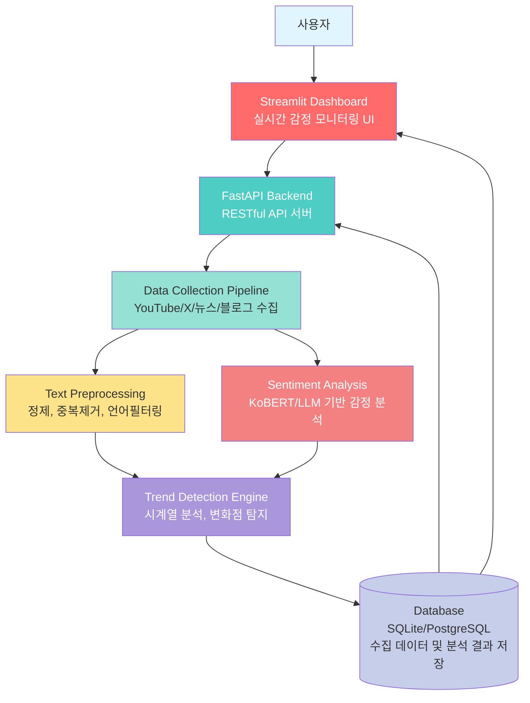
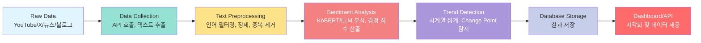

# Social Sentiment & Trend Monitor

실시간 감정 분석 & 트렌드 변화 탐지 서비스

---

## Executive Summary

이 프로젝트는 YouTube 댓글을 실시간으로 수집 후 → 텍스트 전처리 → 감정 분석(KoBERT/LLM) → 시계열 흐름 분석 → 변화점(이상) 자동 탐지를 수행하는 데이터 통합 모니터링 시스템입니다.

**데이터 파이프라인(수집–정제–저장), NLP 모델링, 시계열 분석, API 서버(FastAPI), UI(Streamlit)**까지 엔드투엔드(End-to-End) 구조를 직접 설계·구현했습니다.

실시간 분석 플랫폼 구조로, **데이터 엔지니어링, 모델링, 서비스 개발**을 포함한 전 과정을 다룹니다.

---

> **YouTube·X(트위터)·뉴스·블로그에서 특정 키워드와 관련된 텍스트 데이터를 실시간 또는 준실시간으로 수집하고, 감정 분석 + 시계열 트렌드 분석 + 변화(이상) 탐지를 통해 사람들의 반응 변화를 시각적으로 확인할 수 있는 서비스입니다.**

[](https://www.python.org/)
[](https://fastapi.tiangolo.com/)
[](https://streamlit.io/)
[](LICENSE)

## 목차

- [Executive Summary](#executive-summary)
- [역량](#역량)
- [TL;DR](#-tldr)
- [프로젝트 개요](#-프로젝트-개요)
- [시스템 아키텍처](#-시스템-아키텍처)
- [핵심 기능](#-핵심-기능)
- [기술 스택](#-기술-스택)
- [설치 및 실행](#-설치-및-실행)
- [프로젝트 구조](#-프로젝트-구조)
- [API 문서](#-api-문서)
- [상세 문서](#-상세-문서)

---

## TL;DR

**핵심 요약**:
- **실시간 데이터 수집**: YouTube, X(트위터), 뉴스, 블로그에서 키워드 기반 텍스트 수집
- **감정 분석**: KoBERT 또는 LLM 기반 한국어 감정 분석 (긍정/부정/중립)
- **트렌드 변화 탐지**: 시계열 분석을 통한 급격한 여론 변화 구간 자동 탐지
- **실시간 대시보드**: Streamlit 기반 감정 흐름 시각화 및 모니터링
- **RESTful API**: FastAPI 기반 데이터 서비스 제공

---

## 프로젝트 개요

### 목적
온라인 텍스트 기반의 감정 흐름을 실시간으로 모니터링하고, 트렌드 변화를 자동으로 감지하는 시스템을 구축합니다.

### 주요 특징
- **다양한 소스 지원**: YouTube, X(트위터), 뉴스, 블로그
- **실시간 감정 분석**: KoBERT 또는 OpenAI API 기반 감정 점수 산출
- **트렌드 변화 탐지**: Change Point Detection 알고리즘으로 급격한 변화 구간 탐지
- **시각화 대시보드**: Streamlit 기반 실시간 모니터링 UI
- **RESTful API**: FastAPI 기반 데이터 서비스

---

## 역량

### 1) 엔드투엔드 데이터 파이프라인 설계 능력
- **Raw 수집 → 전처리 → 감정 분석 → 시계열 분석 → DB 저장 → UI까지 풀 사이클 개발**
- Collector / Preprocessing / Sentiment / Trend / API 계층 완전 분리 구성
- 재사용성과 유지보수성 높은 구조

### 2) API 통신·데이터 엔지니어링 역량
- **YouTube Data API 실제 호출**
- 오류 처리, 재시도 로직, 요청 제한 처리
- DB 구조 설계(SQLite → PostgreSQL 확장 가능)

### 3) 한국어 NLP 모델 활용 능력
- **규칙 기반 감정 분석기 직접 설계 (키워드 100+)**
- KoBERT·KcBERT 등 BERT 기반 모델 적용 가능
- OpenAI 기반 분석기 확장 기능 내장

### 4) 시계열 분석·변화점 탐지 능력
- **Simple Change Detector 자체 구현**
- 시간 단위 감정 평균 → 변동률 기반 변화점 감지
- ruptures 알고리즘 기반 고급 탐지로 확장 준비됨

### 5) 데이터 시각화 & UX 능력
- **Streamlit 기반 실시간 대시보드**
- Donut / Gauge / Word Cloud / Trend Chart
- 변화점 Highlight(점선/마커)로 인사이트 제공

### 6) 백엔드·서비스 설계 역량
- **FastAPI 기반 RESTful API 설계**
- Swagger UI 자동 문서화
- Dashboard ↔ API 연동 완성

### 7) 문서화·구조화 능력
- 아키텍처 문서
- 설치·실행 가이드
- API 문서
- 구현 상태 문서

---

## 시스템 아키텍처

### 전체 시스템 구조 다이어그램



### 데이터 파이프라인 다이어그램



### 데이터 흐름 상세

```
Raw Data (YouTube/X/뉴스/블로그)
    │
    ▼
┌──────────────────────────┐
│   Data Collection       │
│  - API 호출              │
│  - 텍스트 추출            │
└───────────┬──────────────┘
            │
            ▼
┌─────────────────────────┐
│   Text Preprocessing    │
│  - 언어 필터링           │
│  - 정제 및 정규화         │
│  - 중복 제거             │
└───────────┬─────────────┘
            │
            ▼
┌─────────────────────────┐
│   Sentiment Analysis    │
│  - KoBERT/LLM 분석       │
│  - 감정 점수 산출         │
└───────────┬─────────────┘
            │
            ▼
┌─────────────────────────┐
│   Trend Detection       │
│  - 시계열 집계           │
│  - Change Point 탐지     │
└───────────┬─────────────┘
            │
            ▼
┌─────────────────────────┐
│   Database Storage      │
│  - 결과 저장             │
│  - 대시보드 제공          │
└─────────────────────────┘
```

---

## 핵심 기능

| 기능 | 설명 |
|------|------|
| **데이터 수집** | YouTube API 연동 (Search + CommentThreads + Videos API) |
| **전처리** | HTML/이모지/URL 제거, 반복 문자 축약, 한국어 필터링 |
| **감정 분석** | 규칙 기반 분석기 (한국어 키워드 매칭, 100+ 키워드) |
| **트렌드 분석** | 시계열 집계 (시간별 평균 감정 점수) |
| **변화 탐지** | 10분 단위 변화율 기반 Change Point 탐지 |
| **대시보드** | Streamlit 기반 실시간 모니터링 UI (트렌드 그래프, Word Cloud, 변화점 Highlight) |
| **REST API** | FastAPI 기반 데이터 서비스 (댓글, 감정, 트렌드 조회) |

---

## 기술 스택

- **Backend**: FastAPI, Python 3.11+
- **Frontend**: Streamlit
- **NLP**: 규칙 기반 분석기, KcBERT-base, OpenAI API (옵션)
- **Database**: SQLite (PostgreSQL 지원 가능)
- **Data Processing**: Pandas, NumPy
- **Visualization**: Plotly, WordCloud, Matplotlib
- **APIs**: YouTube Data API v3
- **Deployment**: Docker (선택사항)

---

## 설치 및 실행

### 요구사항
- Python 3.11+
- API 키 (YouTube Data API, Twitter API, OpenAI API 등)

### 설치

1. **저장소 클론**
```bash
git clone https://github.com/yanggangyiplus/Social-sentiment-trend-monitor.git
cd Social-sentiment-trend-monitor
```

2. **가상환경 생성 및 활성화**
```bash
# 가상환경 생성
python3 -m venv venv

# 가상환경 활성화
# macOS/Linux:
source venv/bin/activate
# Windows:
# venv\Scripts\activate
```

3. **의존성 설치**
```bash
pip install --upgrade pip
pip install -r requirements.txt
```

3. **YouTube API 키 설정** (필수)
   - [Google Cloud Console](https://console.cloud.google.com/)에서 YouTube Data API v3 키 발급
   - `configs/config_collector.yaml` 파일에 API 키 입력:
   ```yaml
   sources:
     youtube:
       enabled: true
       api_key: "YOUR_YOUTUBE_API_KEY"  # 여기에 입력
   ```
   - 상세 가이드: [docs/YOUTUBE_SETUP.md](docs/YOUTUBE_SETUP.md)

4. **기타 설정 파일 구성**
   - 설정 파일 예제를 복사하여 사용:
   ```bash
   cp configs/config_collector.example.yaml configs/config_collector.yaml
   cp configs/config_sentiment.example.yaml configs/config_sentiment.yaml
   cp configs/config_trend.example.yaml configs/config_trend.yaml
   cp configs/config_api.example.yaml configs/config_api.yaml
   ```
   - 각 설정 파일에서 필요한 값 입력 (API 키 등)

### 실행

#### 데이터 수집
```bash
python scripts/run_collector.py --keyword "아이폰"
```

#### 감정 분석
```bash
python scripts/run_sentiment_analysis.py --keyword "아이폰"
```

#### 트렌드 탐지
```bash
python scripts/run_trend_detection.py --keyword "아이폰"
```

#### Streamlit 대시보드
```bash
bash scripts/run_streamlit.sh
# 또는
streamlit run app/web_demo.py --server.port 8501
```

#### FastAPI 백엔드
```bash
bash scripts/run_api.sh
# 또는
uvicorn app.api:app --host 0.0.0.0 --port 8000 --reload
```

### 데이터베이스 초기화

프로젝트를 처음 실행할 때 데이터베이스가 자동으로 생성됩니다. 수동으로 초기화하려면:

```bash
python3 -c "from src.database.db_manager import init_database; init_database('sqlite:///data/database/sentiment.db')"
```

또는 대시보드나 API를 실행하면 자동으로 데이터베이스가 생성됩니다.

---

## 프로젝트 구조

```
Social-sentiment-trend-monitor/
├── app/                    # 웹 애플리케이션
│   ├── web_demo.py        # Streamlit 대시보드 (트렌드 시각화, Word Cloud, 변화점 Highlight)
│   └── api.py             # FastAPI 백엔드 (RESTful API)
├── configs/               # 설정 파일
│   ├── *.example.yaml     # 설정 파일 예제 (복사하여 사용)
│   ├── config_collector.yaml    # 데이터 수집 설정
│   ├── config_sentiment.yaml    # 감정 분석 설정
│   ├── config_trend.yaml        # 트렌드 분석 설정
│   └── config_api.yaml          # API 서버 설정
├── data/                  # 데이터
│   ├── raw/              # 원본 수집 데이터
│   ├── processed/        # 전처리된 데이터
│   └── database/          # 데이터베이스 파일
├── src/                   # 소스 코드
│   ├── collectors/       # 데이터 수집
│   │   ├── base_collector.py
│   │   ├── youtube_collector.py
│   │   ├── twitter_collector.py
│   │   ├── news_collector.py
│   │   ├── blog_collector.py
│   │   └── collector_manager.py
│   ├── preprocessing/    # 전처리
│   │   ├── text_cleaner.py
│   │   └── deduplicator.py
│   ├── sentiment/        # 감정 분석
│   │   ├── rule_based_analyzer.py  # 규칙 기반 분석기 (기본 사용)
│   │   ├── kcbert_analyzer.py      # KcBERT 분석기
│   │   ├── kobert_analyzer.py      # KoBERT 분석기 (호환성)
│   │   ├── llm_analyzer.py         # LLM 분석기 (OpenAI API)
│   │   └── sentiment_utils.py      # 감정 분석 통합 유틸리티
│   ├── trend/            # 트렌드 분석
│   │   ├── time_series.py           # 시계열 집계
│   │   ├── simple_change_detector.py # 간단한 변화점 탐지 (v0)
│   │   ├── change_detection.py      # 전문 변화점 탐지 (v1, ruptures)
│   │   └── trend_utils.py           # 트렌드 분석 통합 유틸리티
│   ├── database/         # 데이터베이스
│   │   ├── models.py
│   │   └── db_manager.py
│   └── utils/           # 유틸리티
│       ├── config.py
│       ├── logger.py
│       └── seed.py
├── scripts/              # 실행 스크립트
│   ├── run_collector.py
│   ├── run_sentiment_analysis.py
│   ├── run_trend_detection.py
│   ├── run_streamlit.sh
│   └── run_api.sh
├── experiments/          # 실험 결과
├── docs/                 # 문서
├── README.md             # 프로젝트 설명
├── requirements.txt      # 의존성 목록
└── setup.py              # 패키지 설정
```

---

## API 문서

### 주요 엔드포인트

- `GET /` - API 정보
- `GET /health` - 헬스 체크
- `GET /sentiment/recent` - 최근 감정 분석 결과 조회
- `GET /trend/{keyword}` - 특정 키워드의 트렌드 조회
- `GET /alerts` - 변화 감지 알림 조회
- `POST /collect` - 데이터 수집 시작
- `GET /keywords` - 등록된 키워드 목록 조회

자세한 API 문서는 `/docs` 엔드포인트에서 Swagger UI로 확인할 수 있습니다.

---

## 사용 예시

### 1. 데이터 수집 및 분석 파이프라인

```bash
# 1. 데이터 수집
python scripts/run_collector.py --keyword "아이폰" --max-results 50

# 2. 감정 분석
python scripts/run_sentiment_analysis.py --keyword "아이폰" --hours 24

# 3. 트렌드 탐지
python scripts/run_trend_detection.py --keyword "아이폰" --hours 24
```

### 2. API 사용

```python
import requests

# 최근 감정 분석 결과 조회
response = requests.get("http://localhost:8000/sentiment/recent", 
                       params={"keyword": "아이폰", "limit": 100})
data = response.json()

# 트렌드 조회
response = requests.get("http://localhost:8000/trend/아이폰", 
                       params={"hours": 24})
trend = response.json()
```

---

## 라이선스

이 프로젝트는 MIT 라이선스 하에 배포됩니다.

---

## 작성자

**yanggangyi**

- GitHub: [@yanggangyiplus](https://github.com/yanggangyiplus)

---

## 버전 정보

### v0 (현재 버전)
- **YouTube**: 실제 API 연동 완료 (Search + CommentThreads + Videos API)
- **감정 분석**: 규칙 기반 분석기 (한국어 키워드 기반, 100+ 키워드)
- **트렌드 분석**: 시계열 분석 및 변화점 탐지 (10분 단위)
- **대시보드**: Streamlit 기반 실시간 모니터링 UI
  - 트렌드 선그래프 + 변화점 Highlight
  - Word Cloud (긍정/부정 키워드)
  - 비디오별 상세 분석
  - 데이터 다운로드 기능
- **API**: FastAPI 기반 RESTful API
- **Twitter/X**: Mock Data (v2에서 실제 구현 예정)
- **뉴스/블로그**: Mock Data (v1에서 실제 구현 예정)

### 향후 계획
- **v1**: 뉴스/블로그 실제 API 연동, 전문 Change Point Detection 알고리즘 (ruptures)
- **v2**: Twitter/X 실제 API 연동, Fine-tuning된 KcBERT 모델 지원

## 상세 문서

- [설치 및 실행 가이드](docs/INSTALL_AND_RUN.md)
- [YouTube API 설정 가이드](docs/YOUTUBE_SETUP.md)
- [API 문서](docs/API_DOCUMENTATION.md)
- [아키텍처 문서](docs/ARCHITECTURE.md)
